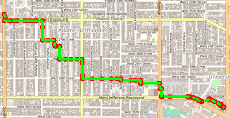
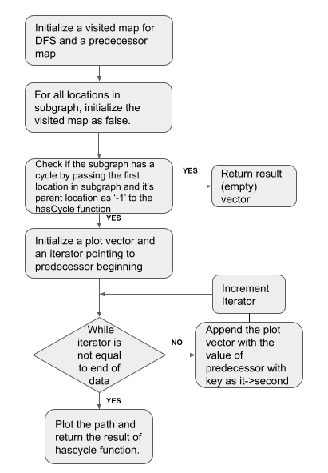
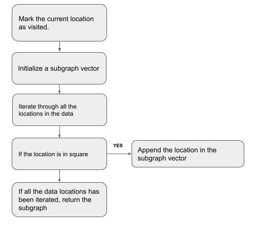
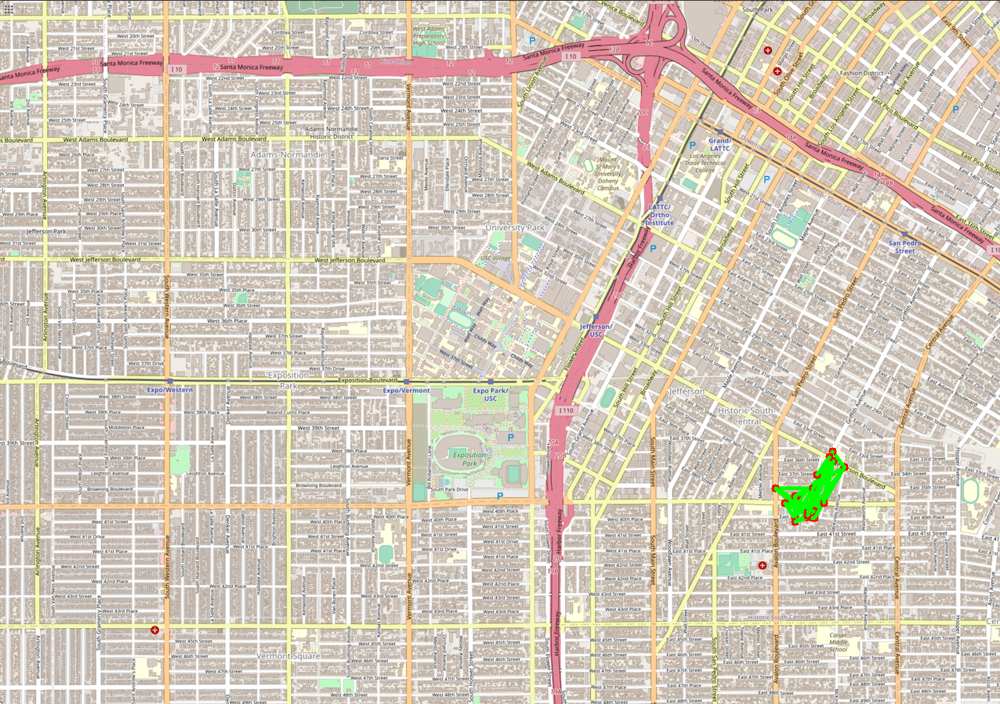
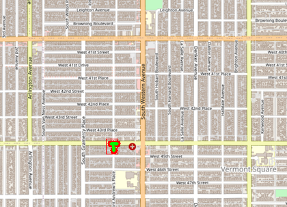
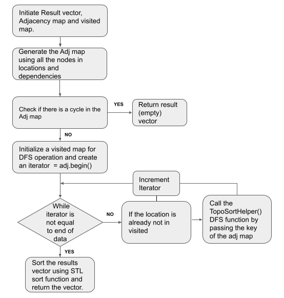
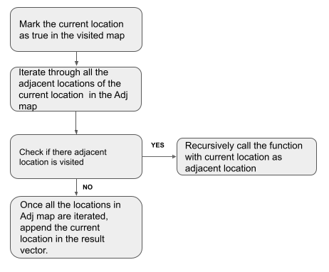
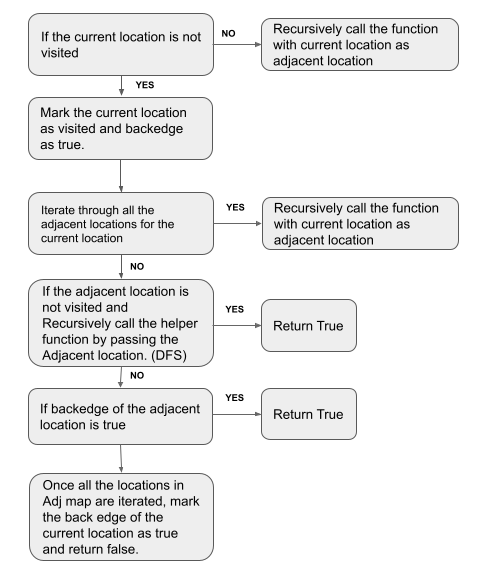

# TROJAN MAP | PROJECT REPORT

Team Members : Sudharshan Subramaniam Janakiraman (USC ID : 8125560141), Amrith Coumaran (USC ID: 2199462730)

<p align="center"></p>

# PROJECT FOCUS
This project focuses on using data structures in C++ and implementing various graph algorithms to build a map application. We will have small features similar to Google Maps such as Autocomplete, Finding the exact location of a place in the map. This project will also involve analysis of time complexity of each function utilized to full fill a particular application as well as test case behavior analysis to check if the written code indeed works as expected.

# MAP FEATURES

- ```Autocomplete``` : Displays a list of location based on the partial case insensitive input by the user
- ```FindLocation``` : Finds the location (Latitude and Longitude) given an input location (Exact Match) otherwise finds the location of the lexicographically closest matching location to the word

## Utility Functions
- ```double GetLat(const std::string& id);```  returns the latitude given the unique id : Time Complexity  O(1)
- ```double GetLon(const std::string& id);``` : returns the longitude given the unique id : TIme Complexity O(1)
- ```std::string GetName(const std::string& id);``` : returns the Name of the location given the unique id: Time COmplexity O(1)
- ```std::string GetID(const std::string& name);``` : Returns the Unique ID if the given name exists in the database :  Time Complexity O(n) where n = number of unique id in the database
- ```std::vector<std::string> GetNeighborIDs(const std::string& id);``` : Returns the list of neighbour id's given the unique id: Time Complexity O(1).

These Functions will be called by other functions in the project to access the required data which is stored in a map <Unique id, Node>.

## Feature 1 : Auto Complete

The AutoComplete function uses the user input as a prefix and outputs the locations which start with the prefix. If the prefix is the entire word and is available in the database, then only the word gets displayed. The function is not case sensitive and accounts for human error of adding a space before and/or after the prefix while typing. If the input is null, then the program outputs all the location names in the database. If the output sequence has more than one location, the output will be in a sorted order. 

The Declaration of the function is given as ```std::vector<std::string> TrojanMap::Autocomplete(std::string name);```

Flow Chart of the Function:
<p align="center"></p>

The ```Time Complexity = O(n)``` where n = #ID's in the database

### RESULTS: 
#### Case Scenario 1 : Input : "chi"

<p align="center"></p>

#### Case Scenario 2 : Input : "sain"

<p align="center"></p>

Note :  Changes have been made in the mapui.cc to Handle Empty input and input with trailing and leading white spaces in a better way. If the User Inputs an empty name, Then The MENU dispalys all the locations from the database and if the prefix has leading or trailing spaces, then the code has been changed to trim the spaces and only take the prefix.  

<p align="center"></p>


## Feature 2 : Find The Location

This Feature focuses on finding the location in the map (Latitude and Longitude) based on the input provided by the user. The input is of type std::string. 

The Declaration of the function is given as ```std::pair<double, double> GetPosition(std::string name);```

Flow Chart of the Function:
<p align="center"></p>

As We can see that there is one loop which will help us finding the location given  the name, 

The ```Time Complexity = O(n)``` where n = # Unique ID's in the data

Observation : This GetPosition Will only return proper location if the user inputs correct case sensitive data, Otherwise it will return (-1, -1). This provides a limitation when the user doesnt follow case sensitivity or Makes spelling mistakes in Input

In order the rectify the above limitation we will make use of two more function CalculateEditDistance and FindClosestName. as the name suggests, The FindClosestName function will find if there are any names which are lexicographically closer to the user's input name. For Finding such name, this function will make use of CalculateEditDIstance which returns the EditDistance between two string ( i.e., Number of operations needed (Insert delete, replace) to convert one string to another string). Find Closest Name will run the input name against all names in the data and will select the name from data which has minimum EditDistance.

The declaration of the two function in the program are given as 

Declaration of CalculateEditDistance Function : ```int CalculateEditDistance(std::string, std::string);```

This Function Takes 2 strings as input and returns the edit distance between them. Tabulation Dynamic Programming is used so calculate EditDistance.

Flow Chart of CalculateEditDistance FUnction:
<p align="center"></p>

The ```Time Complexity = O(mn)``` where m = Length of String 1, n = Length of String 2

Declaration of FindClosestName Function : ```std::string FindClosestName(std::string name);```

This Function takes an input name and returns a name(string) which is lexicographically closer to the input name (string)

Flow Chart of FindClosestName FUnction:
<p align="center"></p>

The ```Time Complexity = O(nlp)``` where n = # unique ID's, l = Length of Input Name, p = Length of the Largest Name in the data 

### RESULTS : The location found will also be plotted on the map

#### Case Scenario 1 : When User Inputs Case Sensitive Correct Input

Input = Ralphs, Run Time = 2ms (GetPosition Function is Directly Called)
<p align="center"></p>
<p align="center"></p>

Input = Target, Run Time = 2ms (GetPosition Function is Directly Called)
<p align="center"></p>
<p align="center"></p>

#### Case Scenario 2 : When the User Inputs Case sensitive improper Input

Input : rOLPhs, Run Time : 11 + 2 = 13 ms

<p align="center"></p>
<p align="center"></p>

Input : Trider Jaes, Run Time : 15 + 3 = 18 ms

<p align="center"></p>
<p align="center"></p>

Note :  Changes have been made in the mapui.cc to Handle Empty input and input with trialing and leading white spaces in a better way. If the User Inputs empty name, Then The MENU dispalys that the input in empty and asks whether the user wants to enter new input or not. Leading and traialing white spaces are trimmed

<p align="center"></p>


## Feature 3 : Calculate Shortest Path

This Feature Focusses on Computing the shortest path between two given places using two famous Algoriths
- ```Dijkstra's Shortest Path Algorithm```
- ```Bellman Ford Shortest Path Algorithm```

#### ```Dijkstra's Algorithm```

Dijkstra Algorithms Computes the shortest path between two nodes. In This Algorithm, The Source Node is Fixed (Single Source Node) and computes shortest path to all other nodes from the source Node. Our Algorithm Returs the shortest path from source node to end node. It is a greedy algorithm which visits the closest node (shortest distance node) and expects to grow.

The Declaration of the function is given as ```std::vector<std::string> CalculateShortestPath_Dijkstra(std::string location1_name,std::string location2_name);```

Flow Chart | Dijkstra | Shortest Path
<p align="center"></p>

The Algorithm Uses Minheap data structure so that finding the shortest distance next node from the priority is O(1) as we can access the data from the top.

The ``` Time Complexity = O((m+n) log(n))``` where m = Number of Nodes, n = Number of Edges

#### ```Bellman Ford Algorithm```

Bellman-ford is a single source shortest pathh algorith, which will find the shortest distance between source node an every other node in the map along with the shortest path. One advantage of Bellman-ford algorithm is that it can handle and report negative edges while Dijkstra cannot. However ballman ford is much slower than dijkstra algorithm as it has to go though all nodes multiple number of times

The Declaration of the function is given as ```std::vector<std::string> CalculateShortestPath_Bellman_Ford(std::string location1_name,std::string location2_name);```

Flow Chart | Bellman Ford | Shortest Path
<p align="center"></p>

The ``` Time Complexity = O(mn)``` where m = Number of Nodes, n = Number of Edges


### RESULTS : Shortest Path Between Two Locations (DIJKSTRA, BELLMANFORD, GOOGLE MAPS):

#### SOURCE = Ralphs | DESTINATION = Target
<p align="center">


</p>
<p align="center"></p>

#### SOURCE = FaceHaus | DESTINATION = Western and adams 3
<p align="center">



</p>

<p align="center"></p>

#### SOURCE = Vermont & 39th (Metro 204 Northbound) (#05658) | DESTINATION = McDonalds
<p align="center">


</p>

<p align="center"></p>

#### Comparison

| Source | Destination | Dijkstra | Bellman Ford | Google Maps |
| :---: | :---: | :---: | :---: | :---: | 
| Ralphs | Target | 0.927969 miles | 0.927969 miles | 0.9 miles | 
| FaceHaus | Western & Adams 3 | 2.00231 miles | 2.00231 miles | 2 miles |  
| Vermont & 39th (Metro 204 Northbound) (#05658) | McDonalds | 0.971709 miles | 0.971709 miles | 0.9 miles |  

``` Inference ``` The results obtained by Dijkstra and Bellman ford algorithm is in accordance with the google Maps result however Google Maps takes other attributs such as Traffic, Regularly used road and etc., in computation of the path. this effect can be seen in Result 2 :  where our shortest distance algoithm computs overall shortest distance where as Google Maps give much easier route of walking straight at the same distance.

#### RunTime

| Source | Destination | Dijkstra | Bellman Ford |
| :---: | :---: | :---: | :---: | 
| Ralphs | Target | 39 ms | 8132 ms | 
| FaceHaus | Western & Adams 3 | 162 ms | 8861 ms | 
| Vermont & 39th (Metro 204 Northbound) (#05658) | McDonalds | 53 ms | 9103 ms | 

```Inference ```  Dijkstra is much faster compared to Bellman ford algorithm. Usage of min heap using priority queue has reduced the time in dijkstra where as Bellman ford will always be slow as we will have to relax each node atmost |n| - 1 times to get the output. Even with early stopping conditions the algorithms will be slower than Dijkstra Algorithm

## Feature 4: Travelling Salesman

```Goal``` Find the Shortest path to vist all given locations only once and return to the source
The problem has been solved utilizing three famous algorithm.
```Implementation```
- Brute Force
- BackTracking
- 2opt 

#### ```Brute Force```

We generate all possible permutations of path locations and select the path that produces lowest cost.
``` Time Complexity ``` O(n!). The Algorithm is very naive and slow.

The Declaration of Function is given as ``` std::pair<double, std::vector<std::vector<std::string>>> TrojanMap::TravellingTrojan_Brute_force(std::vector<std::string> location_ids) ```

We utilize a helper function called BruteForceHelper which is called recursively to generate all possible permutations.

FlowChart | BruteForce

<p align="center"></p>

```Inference``` Very Slow and Time Consuming

#### ```Backtracking```

We generate all (or some) combinations of path which will provide optimal cost. Decisions are made locally to skip exploring the trees which exceeds the optimal cost. This will speed up the process. However in the worst case scenario, the time complexity is same as O(n!)

The Declaration of Function is given as ``` std::pair<double, std::vector<std::vector<std::string>>> TrojanMap::TravellingTrojan_Brute_force(std::vector<std::string> location_ids) ```

FlowChart | BruteForce

<p align="center"></p>
<p align="center"></p>

we skip exploring nodes which is not optimal

``` Time Complexity O(n!)```

```Inference``` Can be faster or at worst equal to brute force

#### ```2opt```
This is a heuristic approach to solve the travelling salesman problem. 

The Declaration of the function is given as ```std::pair<double,         std::vector<std::vector<std::string>>> TravellingTrojan_2opt(std::vector<std::string> location_ids);```

Flow Chart of the Function:

<p align="center"></p>


The ```Time Complexity = O((n^2) * k)``` where n = #locations, k = Number of iterations untill no improvement was found

We use several helper functions as given below:
1) TravellingTrojan_2optHelper 

This is a helper function which iterated through two indexes and swaps the substring (2opt-swap) and check if the path has the best distance. The function runs untill there is an imporvement, that is, if there is an improvement, then the function is called again.  

The Declaration of the function is given as ```void TravellingTrojan_2optHelper(std::vector<std::string> location_ids,   std::pair<double, std::vector<std::vector<std::string>>> &records);```

Flow Chart of the Function:
<p align="center"></p>

The ```Time Complexity = O((n^2) * k)``` where n = #locations, k = Number of iterations untill no improvement was found

2) Swap2opt

Given the vector and two indexes, the function swaps the substring between s and k and returns the path.

The Declaration of the function is given as ```std::vector<std::string> Swap2opt(std::vector<std::string> location_ids, int s, int k);```

Flow Chart of the Function:
<p align="center"></p>


Observation : 
This is an heuristric based approach to solve the travelling salesman problem. We iterate through all possible combination of index pairs and swap the substring(2-opt swap) (change the edges) and calculate the distance. We call the function recursively untill no improvement has been found. 
This approach, however is very time efficient, sometime it may not give out the best path compared to other two methods. 

### RESULTS (BRUTE FORCE | BACKTRACKING | 2OPT)

We display the path generation video for each of the 3 algorithm for 6 randomly generate locations on the map
<p align="center">


</p>


## Feature 5 : Cycle Detection

This Feature focuses on finding if there exsists a cycle in the subgraph. The input is of type std::vector<double> and output a bool. 

The Declaration of the function is given as ```bool CycleDetection(std::vector<double> &square);```

Flow Chart of the Function:
<p align="center"></p>

The ```Time Complexity = O(m + n)``` where m = #locations, n = # edges 

We use several helper functions as given below:
1) hasCycle 

This function is recursive DFS function to check if the function has a a cycle or not. Returns true if there is a cycle in the given subgraph.

The Declaration of the function is given as ```bool hasCycle(std::string current_id, std::map<std::string, bool> &visited, std::string parent_id,std::vector<double> &square,std::unordered_map<std::string,std::string> &predecessor);```

Flow Chart of the Function:
<p align="center"></p>

The ```Time Complexity = O(m + n)``` where m = #locations, n = # edges 

2) inSquare

This function checks if the given location is in the square (limits of latitudes and longitudes)

The Declaration of the function is given as ```bool inSquare(std::string id, std::vector<double> &square);```

Flow Chart of the Function:
<p align="center"></p>

The ```Time Complexity = O(1)``` 

3) GetSubgraph

Iterates over all the locations in the data and returns the vector of all those locations in the square

The Declaration of the function is given as ```std::vector<std::string> GetSubgraph(std::vector<double> &square);```

Flow Chart of the Function:
<p align="center"></p>


The ```Time Complexity = O(n)``` where n = # Unique ID's in the data

Observation : 
This function emphasis another important application of DFS, that is finding if exsists a cycle in the graph. In this case, the graph is undirected and we apply recursive DFS function itreating through all the location. If the location is not already visited and recursively call the DFS function again for it's childern nodes. If the location is already visited, in the square and is not the parent location, return true, else return false.

While iterating through all the nodes, keep updating the predecessor map based on the current location and it's parent location. We use this predecessor map to plot the locations in the cycle on the map. If there are not cycle detection, just return false and not plot any locations. We use the given PlotPath function to display the locations on the map (No changes made to the function).

### RESULTS: 
#### Case Scenario 1 : Input : {-118.264, -118.260, 34.014, 34.010}

<p align="center"></p>

<p align="center"></p>

<p align="center"></p>

#### Case Scenario 2 : Input : {-118.312, -118.311, 34.004, 34.003}

<p align="center"></p>

<p align="center"></p>

## Feature 6 : Topological Sort

This Feature focuses on finding a path through the given location and depending on the given dependecies. The input to the function is of the form std::vector<std::string>.  

The Declaration of the function is given as ```std::vector<std::string> DeliveringTrojan(std::vector<std::string> &location_names,std::vector<std::vector<std::string>> &dependencies);```

Flow Chart of the Function:
<p align="center"></p>

The ```Time Complexity = O(m + n)``` where n = # of locations and m = # of dependencies

We use several helper functions as given below:
1) TopoSortHelper 

This function is recursive DFS function which returns the location in the order of the Depth first algorithm, we then reverse this string and get the topological order.

The Declaration of the function is given as ```void TopoSortHelper(std::string location, std::map<std::string, bool> &visited,std::unordered_map<std::string, std::vector<std::string>> adj ,std::vector<std::string> &topo_list);```

Flow Chart of the Function:
<p align="center"></p>

The ```Time Complexity = O(m + n)``` where n = # of locations and m = # of dependencies

2) TopoCycle

The function uses a helper function and return true if there exsists a cycle in the given graph. As this a directed graph, we call the DFS Helper function from all the unvisited locations in the adjacency matrix. 

The Declaration of the function is given as ```bool TopoCycle(std::vector<std::string> locations,std::unordered_map<std::string, std::vector<std::string>> adj);```

Flow Chart of the Function:
<p align="center"></p>

3) TopoCycleHelper

This is a helper function for TopoCycle and uses recursive method to perform DFS. As this a direceted graph, we keep track of back edges, If there is a back edge, then there is a cycle in the graph. We mark the current location as visited and backedge as true. Iterate through all univisted locations connected and perform DFS on it and return true if there is a backedge. Return false if there is no back edge. 

The Declaration of the function is given as ```bool TopoCycleHelper(std::string current_id, std::map<std::string, bool> &visited,std::unordered_map<std::string, std::vector<std::string>> adj,std::map<std::string, bool> &rechelper);```

Flow Chart of the Function:
<p align="center"></p>


The ```Time Complexity = O(m + n)``` where n = # of locations and m = # of dependencies

Observation : 
The function uses DFS algorithm to find the topological order. The function converts the given dependencies to a Adjacent matrix. We have to make sure this is a DAG, so we check if there exists a cycle in the graph, if not, we can find a topological order as it is dependent on the DAG, so the function return an empty vector. 

If there is no cycle detected in the graph, we perform DFS, and find the output of DFS over all the nodes. We then reverse the output as we need a topological order, and return the output vector. The output is then plotted on the map using the given function with arrow marks giving the directions. 

### RESULTS: 
#### Case Scenario 1 : Input : 
#### location_names = {"Ralphs", "KFC", "Chick-fil-A"}
#### dependencies = {{"Ralphs","Chick-fil-A"}, {"Ralphs","KFC"},{"Chick-fil-A","KFC" }                       

<p align="center"></p>

<p align="center"></p>

#### Case Scenario 2 : Input : 
#### location_names = {"Ralphs", "KFC", "Chick-fil-A"}
#### dependencies = {{"Chick-fil-A","Ralphs"},{"Ralphs","KFC"},{"Chick-fil-A","KFC"}}

<p align="center"></p>

<p align="center"></p>

#### Case Scenario 3 : Input : 
#### location_names = {"Ralphs", "KFC", "Chick-fil-A"}
#### dependencies = {{"Chick-fil-A","Ralphs"},{"Ralphs","Chick-fil-A"}}

<p align="center"></p>


## Feature 7 : Find Nearby

This Feature focuses on finding the nearest locations belonging to a specified class to the given input inside a given radius. 

The Declaration of the function is given as ```std::vector<std::string> FindNearby(std::string attributesName, std::string name, double r, int k);```

Flow Chart of the Function:
<p align="center"></p>

The ```Time Complexity = O(n)``` where n = #locations

Observation : 
We iterate through all the locations in dataset and if a name exists and if it belongs to a given class, we make use of the CalculatePathLength function to find the distance between the given location(center) to the iterated location. We consider this location if the distance is less than radius. The ID and the distance is stored a pair.

Once we find all the locations which matches our conditions, we then use the STL heap data structure. We then sort it based on the distance and return k(given input) closest locations to the given ID.

### RESULTS: 
#### Case Scenario 1 : Input : (attribute: "supermarket", locations: "Ralphs", radius: 10, k: 10)

<p align="center"></p>

<p align="center"></p>

#### Case Scenario 2 : Input : Input : (attribute: "supermarket", locations: "Little Galen Center", radius: 10, k: 10)

<p align="center"></p>

<p align="center"></p>

## Feature: 3-opt (EXTRA CREDIT)
This is a heuristic approach to solve the travelling salesman problem. 

The Declaration of the function is given as ```std::pair<double,         std::vector<std::vector<std::string>>> TravellingTrojan_3opt(std::vector<std::string> location_ids);```

Flow Chart of the Function:

<p align="center"></p>

The ```Time Complexity = O((n^3) * k)``` where n = #locations, k = Number of iterations untill no improvement was found

We use several helper functions as given below:
1) TravellingTrojan_3optHelper 

This is a helper function which iterats through all combination of three indexes and swaps the substring (2opt-swap) and check if the path has the best distance. The function runs untill there is an imporvement, that is, if there is an improvement, then the function is called again.  

The Declaration of the function is given as ```void TravellingTrojan_3optHelper(std::vector<std::string> location_ids,   std::pair<double, std::vector<std::vector<std::string>>> &records);```

Flow Chart of the Function:
<p align="center"></p>

The ```Time Complexity = O((n^2) * k)``` where n = #locations, k = Number of iterations untill no improvement was found

2) Swap3opt

Given the vector and two indexes, the function swaps the substring between s and k and returns the path.

The Declaration of the function is given as ```std::vector<std::string> Swap3opt(std::vector<std::string> location_ids, int s, int k);```

Flow Chart of the Function:
<p align="center"></p>


Observation : 
This is an heuristric based approach to solve the travelling salesman problem. We iterate through all possible combination of index pairs and swap the substring(2-opt swap) (change the edges) and calculate the distance. We call the function recursively untill no improvement has been found. This very similar to 2-opt, only difference is that we exhcange three edges with all perumutations and check if there is any improvement or not.
This approach, however is very time efficient, sometime it may not give out the best path compared to brute force or backtracking.

### RESULTS: 
We display the path generation video for 3-opt algorithm for 6 randomly generate locations on the map
<p align="center">

</p>

## Time Complexity

| Function | Complexity | Comments | 
| :--- | :--- | :---: |
| GetLat() | O(1) |  |
| GetLon() | O(1) |  |
| Getname() | O(1) |  | 
| GetID() | O(n) |  |
| GetNeighborIDs() | O(1) |  |
| Autocomplete() | O(n) | n = # of IDs in database | 
| GetPosition() | O(n) |  | 
| CalculateEditDistance() | O(mn) |  |
| FindClosestName() | O(nlp) |  |
| CalculateShortestPath_Dijkstra() | O((m+n) logn) |  | 
| CalculateShortestPath_Bellman_Ford() | O(mn) |  | 
| ReadLocationsFromCSVFile() | O(n) | n = # of IDs in database |
| ReadDependenciesFromCSVFile() | O(n) | n = # of IDs in database |
| DeliveringTrojan() | O(m+n) | m = # of locations, n = # of edges | 
| TopoSortHelper() | O(m+n) | m = # of locations, n = # of edges |
| TopoCycle() | O(m + n) | m = # of locations, n = # of edges | 
| TravellingTrojan_Brute_force() | O() |  | 
| TravellingTrojan_Backtracking() | O() |  |
| TravellingTrojan_2opt() | O() |  |
| GetSubgraph() | O(n) |  n = # of IDs in database| 
| inSquare() | O(1) |  | 
| CycleDetection() | O(m + n) | m = # of locations, n = # of edges | 
| hasCycle() | O(m + n) | m = # of locations, n = # of edges | 
| FindNearby() | O(n) | n = # of IDs in database | 


