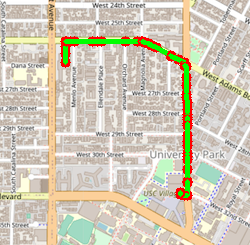
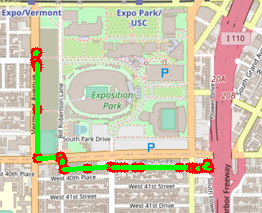

# TROJAN MAP | PROJECT REPORT

Team Members : Sudharshan Subramaniam Janakiraman (USC ID : 8125560141), Amrith Coumaran (USC ID: 2199462730)

<p align="center"></p>

# PROJECT FOCUS
This project focuses on using data structures in C++ and implementing various graph algorithms to build a map application. We will have small features similar to Google Maps such as Autocomplete, Finding the exact location of a place in the map. This project will also involve analysis of time complexity of each function utilized to full fill a particular application as well as test case behavior analysis to check if the written code indeed works as expected.

# MAP FEATURES

- ```Autocomplete``` : Displays a list of location based on the partial case insensitive input by the user
- ```FindLocation``` : Finds the location (Latitude and Longitude) given an input location (Exact Match) otherwise finds the location of the lexicographically closest matching location to the word

## Utility Functions
- ```double GetLat(const std::string& id);```  returns the latitude given the unique id : Time Complexity  O(1)
- ```double GetLon(const std::string& id);``` : returns the longitude given the unique id : TIme Complexity O(1)
- ```std::string GetName(const std::string& id);``` : returns the Name of the location given the unique id: Time COmplexity O(1)
- ```std::string GetID(const std::string& name);``` : Returns the Unique ID if the given name exists in the database :  Time Complexity O(n) where n = number of unique id in the database
- ```std::vector<std::string> GetNeighborIDs(const std::string& id);``` : Returns the list of neighbour id's given the unique id: Time Complexity O(1).

These Functions will be called by other functions in the project to access the required data which is stored in a map <Unique id, Node>.

## Feature 1 : Auto Complete

The AutoComplete function uses the user input as a prefix and outputs the locations which start with the prefix. If the prefix is the entire word and is available in the database, then only the word gets displayed. The function is not case sensitive and accounts for human error of adding a space before and/or after the prefix while typing. If the input is null, then the program outputs all the location names in the database. If the output sequence has more than one location, the output will be in a sorted order. 

The Declaration of the function is given as ```std::vector<std::string> TrojanMap::Autocomplete(std::string name);```

Flow Chart of the Function:
<p align="center"></p>

The ```Time Complexity = O(n)``` where n = #ID's in the database

### RESULTS: 
#### Case Scenario 1 : Input : "chi"

<p align="center"></p>

#### Case Scenario 2 : Input : "sain"

<p align="center"></p>

Note :  Changes have been made in the mapui.cc to Handle Empty input and input with trailing and leading white spaces in a better way. If the User Inputs an empty name, Then The MENU dispalys all the locations from the database and if the prefix has leading or trailing spaces, then the code has been changed to trim the spaces and only take the prefix.  

<p align="center"></p>


## Feature 2 : Find The Location

This Feature focuses on finding the location in the map (Latitude and Longitude) based on the input provided by the user. The input is of type std::string. 

The Declaration of the function is given as ```std::pair<double, double> GetPosition(std::string name);```

Flow Chart of the Function:
<p align="center"></p>

As We can see that there is one loop which will help us finding the location given  the name, 

The ```Time Complexity = O(n)``` where n = # Unique ID's in the data

Observation : This GetPosition Will only return proper location if the user inputs correct case sensitive data, Otherwise it will return (-1, -1). This provides a limitation when the user doesnt follow case sensitivity or Makes spelling mistakes in Input

In order the rectify the above limitation we will make use of two more function CalculateEditDistance and FindClosestName. as the name suggests, The FindClosestName function will find if there are any names which are lexicographically closer to the user's input name. For Finding such name, this function will make use of CalculateEditDIstance which returns the EditDistance between two string ( i.e., Number of operations needed (Insert delete, replace) to convert one string to another string). Find Closest Name will run the input name against all names in the data and will select the name from data which has minimum EditDistance.

The declaration of the two function in the program are given as 

Declaration of CalculateEditDistance Function : ```int CalculateEditDistance(std::string, std::string);```

This Function Takes 2 strings as input and returns the edit distance between them. Tabulation Dynamic Programming is used so calculate EditDistance.

Flow Chart of CalculateEditDistance FUnction:
<p align="center"></p>

The ```Time Complexity = O(mn)``` where m = Length of String 1, n = Length of String 2

Declaration of FindClosestName Function : ```std::string FindClosestName(std::string name);```

This Function takes an input name and returns a name(string) which is lexicographically closer to the input name (string)

Flow Chart of FindClosestName FUnction:
<p align="center"></p>

The ```Time Complexity = O(nlp)``` where n = # unique ID's, l = Length of Input Name, p = Length of the Largest Name in the data 

### RESULTS : The location found will also be plotted on the map

#### Case Scenario 1 : When User Inputs Case Sensitive Correct Input

Input = Ralphs, Run Time = 2ms (GetPosition Function is Directly Called)
<p align="center"></p>
<p align="center"></p>

Input = Target, Run Time = 2ms (GetPosition Function is Directly Called)
<p align="center"></p>
<p align="center"></p>

#### Case Scenario 2 : When the User Inputs Case sensitive improper Input

Input : rOLPhs, Run Time : 11 + 2 = 13 ms

<p align="center"></p>
<p align="center"></p>

Input : Trider Jaes, Run Time : 15 + 3 = 18 ms

<p align="center"></p>
<p align="center"></p>

Note :  Changes have been made in the mapui.cc to Handle Empty input and input with trialing and leading white spaces in a better way. If the User Inputs empty name, Then The MENU dispalys that the input in empty and asks whether the user wants to enter new input or not. Leading and traialing white spaces are trimmed

<p align="center"></p>


## Feature 3 : Calculate Shortest Path

This Feature Focusses on Computing the shortest path between two given places using two famous Algoriths
- ```Dijkstra's Shortest Path Algorithm```
- ```Bellman Ford Shortest Path Algorithm```

#### ```Dijkstra's Algorithm```

Dijkstra Algorithms Computes the shortest path between two nodes. In This Algorithm, The Source Node is Fixed (Single Source Node) and computes shortest path to all other nodes from the source Node. Our Algorithm Returs the shortest path from source node to end node.

The Declaration of the function is given as ```std::vector<std::string> CalculateShortestPath_Dijkstra(std::string location1_name,std::string location2_name);```

Flow Chart | Dijkstra | Shortest Path
<p align="center"></p>

The Algorithm Uses Minheap data structure so that finding the shortest distance next node from the priority is O(1) as we can access the data from the top.

The ``` Time Complexity = O((m+n) log(n))``` where m = Number of Nodes, n = Number of Edges


### RESULTS : Shortest Path Between Two Locations:

#### SOURCE = Ralphs | DESTINATION = Target
<p align="center">


</p>
<p align="center"></p>

#### SOURCE = FaceHaus | DESTINATION = Western and adams 3
<p align="center">


</p>

<p align="center"></p>
#### SOURCE = Vermont & 39th (Metro 204 Northbound) (#05658) | DESTINATION = McDonalds
<p align="center">



</p>

<p align="center"></p>

#### Comparison

| Source | Destination | Dijkstra | Bellman Ford | Google Maps |
| :---: | :---: | :---: | :---: | :---: | 
| Ralphs | Target | 0.927969 miles | 0.927969 miles | 0.9 miles | 
| FaceHaus | Western & Adams 3 | 2.00231 miles | 2.00231 miles | 2 miles |  
| Vermont & 39th (Metro 204 Northbound) (#05658) | McDonalds | 0.971709 miles | 0.971709 miles | 0.9 miles |  

#### RunTime

| Source | Destination | Dijkstra | Bellman Ford |
| :---: | :---: | :---: | :---: | 
| Ralphs | Target | 39 ms | 8132 ms | 
| FaceHaus | Western & Adams 3 | 162 ms | 8861 ms | 
| Vermont & 39th (Metro 204 Northbound) (#05658) | McDonalds | 53 ms | 9103 ms | 


## Time Complexity

| Function | Complexity | Comments | 
| :---: | :---: | :---: |
| GetLat() | O(1) |  |
| GetLon() | O(1) |  |
| Getname() | O(1) |  | 
| GetID() | O(n) |  |
| GetNeighborIDs() | O(1) |  |
| Autocomplete() | O(n) |  | 
| GetPosition() | O(n) |  | 
| CalculateEditDistance() | O(mn) |  |
| FindClosestName() | O(nlp) |  |
| CalculateShortestPath_Dijkstra() | O((m+n) logn) |  | 
| CalculateShortestPath_Bellman_Ford() | O(mn) |  | 
| ReadLocationsFromCSVFile() | O() |  |
| ReadDependenciesFromCSVFile() | O() |  |
| DeliveringTrojan() | O() |  | 
| TopoSortHelper() | O() |  |
| TopoCycleHelper() | O() |  |
| TopoCycle() | O() |  | 
| TravellingTrojan_Brute_force() | O() |  | 
| TravellingTrojan_Backtracking() | O() |  |
| TravellingTrojan_2opt() | O() |  |
| inSquare() | O() |  | 
| CycleDetection() | O() |  | 
| hasCycle() | O() |  | 
| FindNearby() | O() |  | 


